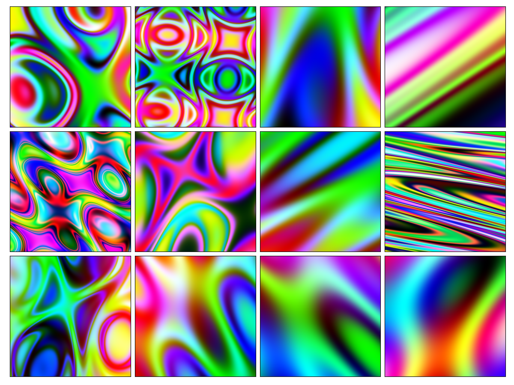

# magic-texture
Generates psychedelic color textures in the spirit of Blender's magic texture shader using Python/Numpy.

<div align='center'>
    
</div>

## Usage

The above plot is generated by

```python
import numpy as np
import matplotlib.pyplot as plt
from mpl_toolkits.axes_grid1 import ImageGrid

import magictex as mtex


def main():
    rng = np.random.default_rng(seed=123)
    fig = plt.figure(figsize=(12, 9))
    grid = ImageGrid(fig, 111, nrows_ncols=(3, 4), axes_pad=0.1)

    # Create canonical coordinates for 1024x1024 image
    coords = mtex.coordinate_grid((1024, 1024))
    for ax in grid:
        # Transform coordinates, distort and generate texture
        tex = mtex.magic(
            mtex.random_transform(coords, rng),
            depth=rng.integers(1, 5),
            distortion=rng.uniform(2, 3),
            rng=rng,
        )
        # Plot
        ax.get_yaxis().set_ticks([])
        ax.get_xaxis().set_ticks([])
        ax.imshow(tex)
    plt.show()

if __name__ == "__main__":
    main()
```

**Tip** for best performance generate coordinates once and reuse them for multiple textures.

## Install

```
pip install git+https://github.com/cheind/magic-texture
```

## Why?
In domain randomization, many aspects controlling the visual scene appearance are massively randomized to synthesize training data for deep learning models. In this respect, magic textures have served us quite well in the recent past (blendtorch2020).

## Benchmark
For different image sizes with `depth=3`
```
(256, 256): coords 0.001 sec/image, magic 0.006 sec/image
(512, 512): coords 0.002 sec/image, magic 0.028 sec/image
(1024, 1024): coords 0.007 sec/image, magic 0.112 sec/image
(2048, 2048): coords 0.029 sec/image, magic 0.450 sec/image
```

See `benchmark.py` for details.

## References
```
@inproceedings{blendtorch2020,
    author = {Christoph Heindl, Lukas Brunner, Sebastian Zambal and Josef Scharinger},
    title = {BlendTorch: A Real-Time, Adaptive Domain Randomization Library},
    booktitle = {
        1st Workshop on Industrial Machine Learning 
        at International Conference on Pattern Recognition (ICPR2020)
    },
    year = {2020},
}
```
