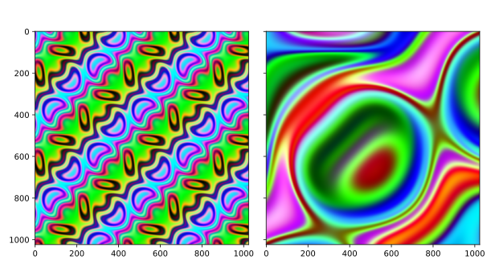

# magic-texture
Generates psychedelic color textures in the spirit of Blender's magic texture shader using Python/Numpy.

<div align='center'>
    
</div>

## Usage

The above plot is generated by

```python
import magictex as mtex

def main():
    coords = mtex.coordinate_grid((1024, 1024))
    tex1 = mtex.magic(coords, scale=2.5, depth=3, distortion=3.0)
    tex2 = mtex.magic(coords, scale=0.8, depth=5, distortion=2.0)

    fig, axs = plt.subplots(1, 2, sharex=True, sharey=True)
    axs[0].imshow(tex1)
    axs[1].imshow(tex2)
    plt.show()
```

**Note** the above is not a deterministic result. See `rng` argument to `magictex.magic` to adjust the behaviour.

**Tip** for best performance generate coordinates once and reuse them for multiple textures.

## Install

```
pip install git+https://github.com/cheind/magic-texture
```

## Why?
In domain randomization, many aspects controlling the visual scene appearance are massively randomized to synthesize training data for deep learning models. In this respect, magic textures have served us quite well in the recent past (blendtorch2020).

## References
```
@inproceedings{blendtorch2020,
    author = {Christoph Heindl, Lukas Brunner, Sebastian Zambal and Josef Scharinger},
    title = {BlendTorch: A Real-Time, Adaptive Domain Randomization Library},
    booktitle = {
        1st Workshop on Industrial Machine Learning 
        at International Conference on Pattern Recognition (ICPR2020)
    },
    year = {2020},
}
```
